## 八上历史（1840—1949）时间轴图（事件 + 条约内容 + 意义）

| 年份/时间    | 归类                   | 当年大事（你要记的“发生了什么”）                                       | 条约/文件（如有）                                                                                                                                                                                       | 条约/文件内容（按课本常考“条款要点全列”）                                                                                                                                                                                                                                                                                                                                                                              | 条约/事件意义（可背诵句）                                                                                                                                                                                                                                                                                                                                                                                                            |
| ------------ | ---------------------- | ------------------------------------------------------------------------ | ------------------------------------------------------------------------------------------------------------------------------------------------------------------------------------------------------- | ------------------------------------------------------------------------------------------------------------------------------------------------------------------------------------------------------------------------------------------------------------------------------------------------------------------------------------------------------------------------------------------------------------------------ | ------------------------------------------------------------------------------------------------------------------------------------------------------------------------------------------------------------------------------------------------------------------------------------------------------------------------------------------------------------------------------------------------------------------------------------ |
| 1839         | 反侵略斗争（背景）     | 林则徐虎门销烟                                                           | —                                                                                                                                                                                                      | —                                                                                                                                                                                                                                                                                                                                                                                                                       | 表明清政府反鸦片立场；成为列强发动战争的重要借口之一                                                                                                                                                                                                                                                                                                                                                                                 |
| 1840—1842   | 侵略与反抗             | 第一次鸦片战争（英国侵略，中国战败）                                     | —                                                                                                                                                                                                      | —                                                                                                                                                                                                                                                                                                                                                                                                                       | 中国被迫打开国门，近代史开端；社会性质开始发生变化（半殖民地半封建化开始）                                                                                                                                                                                                                                                                                                                                                           |
| 1842         | 侵略与条约             | 战后被迫议和                                                             | 《南京条约》 ([Encyclopedia Britannica](https://www.britannica.com/event/Treaty-of-Nanjing?utm_source=chatgpt.com "Treaty of Nanjing                                                                    | Definition, Terms,&amp; Facts"))                                                                                                                                                                                                                                                                                                                                                                                         | 1）**割地**：割香港岛给英国；2）**赔款**：赔偿英国**2100万银元**（常写“2100万”）；3）**开埠通商**：开放广州、福州、厦门、宁波、上海“五口通商”；4）**协定关税/关税主权受损**：关税税率需与英商定（“公平合理税则”）；5）**废除公行（行商）垄断**：英商可与民间自由贸易（打破原“广州一口”与公行体系）。 ([Encyclopedia Britannica](https://www.britannica.com/event/Treaty-of-Nanjing?utm_source=chatgpt.com "Treaty of Nanjing |
| 1843         | 侵略与条约             | 《南京条约》补充条款落地                                                 | 《虎门条约》（《南京条约》附件/补充）                                                                                                                                                                   | 1）**领事裁判权（治外法权）**：英国人在华犯罪由英国领事审判；2）**片面最惠国待遇**：清给他国的权益，英国自动享有；3）进一步细化口岸通商、居留、关税等规则（使不平等体系制度化）。                                                                                                                                                                                                                                        | 进一步破坏**司法主权、外交主权**；不平等条约体系开始成形                                                                                                                                                                                                                                                                                                                                                                             |
| 1844         | 侵略与条约             | 列强跟进索取特权                                                         | 《望厦条约》（中美）、《黄埔条约》（中法）                                                                                                                                                              | 共同要点：多国获得类似**最惠国待遇、领事裁判权、传教/通商便利**等（强化“多国共同特权”格局）。                                                                                                                                                                                                                                                                                                                          | 不平等条约从“中英”扩展为“多国”，中国主权受损进一步加深                                                                                                                                                                                                                                                                                                                                                                           |
| 1851         | 反封建斗争             | 太平天国运动爆发（金田起义）                                             | —                                                                                                                                                                                                      | —                                                                                                                                                                                                                                                                                                                                                                                                                       | 近代规模最大的农民战争之一，沉重打击清统治                                                                                                                                                                                                                                                                                                                                                                                           |
| 1853         | 反封建斗争             | 太平军定都天京                                                           | —                                                                                                                                                                                                      | —                                                                                                                                                                                                                                                                                                                                                                                                                       | 推动运动进入高潮阶段                                                                                                                                                                                                                                                                                                                                                                                                                 |
| 1856—1860   | 侵略与反抗             | 第二次鸦片战争（英法联军侵华；火烧圆明园 1860）                          | —                                                                                                                                                                                                      | —                                                                                                                                                                                                                                                                                                                                                                                                                       | 是第一次鸦片战争的继续和扩大；中国半殖民地化程度进一步加深                                                                                                                                                                                                                                                                                                                                                                           |
| 1858         | 侵略与条约             | 清战败，被迫签约                                                         | 《天津条约》 ([Encyclopedia Britannica](https://www.britannica.com/topic/Treaties-of-Tianjin?utm_source=chatgpt.com "Treaties of Tianjin                                                                | Chinese history"))                                                                                                                                                                                                                                                                                                                                                                                                       | 1）**外国公使进驻北京**（可在北京常驻/设使馆）；2）**增开通商口岸**（对外开放扩大）；3）**外国人可到内地旅行、经商**；4）**传教自由/基督教活动便利**；5）**赔款**等（并推动鸦片贸易进一步公开化）。 ([Encyclopedia Britannica](https://www.britannica.com/topic/Treaties-of-Tianjin?utm_source=chatgpt.com "Treaties of Tianjin                                                                                                      |
| 1858         | 边疆危机（侵略与条约） | 沙俄趁火打劫侵占中国领土                                                 | 《瑷珲条约》（中俄）                                                                                                                                                                                    | 要点（课本抓“领土”）：沙俄夺取黑龙江以北等大片领土，东北边疆严重受损（并为1860进一步侵占埋下基础）。                                                                                                                                                                                                                                                                                                                   | 中国东北领土大量丧失，反映列强“瓜分蚕食”方式多样（不仅靠战争）                                                                                                                                                                                                                                                                                                                                                                     |
| 1860         | 侵略与条约             | 继续战败，被迫再签                                                       | 《北京条约》（中英/中法） ([Encyclopedia Britannica](https://www.britannica.com/topic/Beijing-Convention?utm_source=chatgpt.com "Beijing Convention                                                     | 1860, China"))                                                                                                                                                                                                                                                                                                                                                                                                           | 1）**承认《天津条约》有效并履行**；2）**增开天津为商埠**；3）**割九龙司地方一区给英国**；4）**赔款增加**（加重财政负担）。 ([Encyclopedia Britannica](https://www.britannica.com/topic/Beijing-Convention?utm_source=chatgpt.com "Beijing Convention                                                                                                                                                                             |
| 1860         | 边疆危机（侵略与条约） | 沙俄进一步侵占外东北                                                     | 《中俄北京条约》（又称《北京条约·俄》） ([Encyclopedia Britannica](https://www.britannica.com/event/Treaty-of-Peking?utm_source=chatgpt.com "Treaty of Peking                                          | China-Russia [1860]"))                                                                                                                                                                                                                                                                                                                                                                                                   | 要点：清承认沙俄占有**黑龙江左岸**以及**乌苏里江以东至太平洋**广大地区（外东北大部）。 ([Encyclopedia Britannica](https://www.britannica.com/event/Treaty-of-Peking?utm_source=chatgpt.com "Treaty of Peking                                                                                                                                                                                                                         |
| 1861—1895   | 近代化探索             | 洋务运动（“自强”“求富”）                                             | —                                                                                                                                                                                                      | —                                                                                                                                                                                                                                                                                                                                                                                                                       | 开启近代化探索：军事工业、民用企业、新式教育、海军建设等；但不改封建制度→最终破产                                                                                                                                                                                                                                                                                                                                                   |
| 1871—1881   | 边疆危机与收复         | 伊犁被沙俄占领（1871），后通过交涉与军事压力收回部分                     | 《伊犁条约》（《圣彼得堡条约》1881） ([worldjpn.net](https://worldjpn.net/documents/texts/pw/18810224.T1C.html?utm_source=chatgpt.com "中俄改订条约（伊犁条约，圣彼得堡条约） - 「世界和日本」数据库")) | 1）伊犁大部交还中国，但**伊犁西部等地划归俄国**（边界作有利于俄方调整）；2）中国向俄方支付**900万银卢布**等（赔偿/补偿）；3）增设领事、通商线路、贸易便利等。 ([worldjpn.net](https://worldjpn.net/documents/texts/pw/18810224.T1C.html?utm_source=chatgpt.com "中俄改订条约（伊犁条约，圣彼得堡条约） - 「世界和日本」数据库"))                                                                                         | 体现列强在边疆的侵略与控制；也体现清在西北主权维护的艰难（“收回但付出代价”）                                                                                                                                                                                                                                                                                                                                                       |
| 1876—1878   | 边疆危机与收复         | 左宗棠收复新疆                                                           | —                                                                                                                                                                                                      | —                                                                                                                                                                                                                                                                                                                                                                                                                       | 维护西北边疆主权；为新疆建省奠定基础                                                                                                                                                                                                                                                                                                                                                                                                 |
| 1884         | 边疆治理               | 新疆建省                                                                 | —                                                                                                                                                                                                      | —                                                                                                                                                                                                                                                                                                                                                                                                                       | 强化对西北边疆的有效治理与设防                                                                                                                                                                                                                                                                                                                                                                                                       |
| 1884—1885   | 边疆危机（侵略与反抗） | 中法战争（法国侵略；涉及越南与中越边境）                                 | —                                                                                                                                                                                                      | —                                                                                                                                                                                                                                                                                                                                                                                                                       | 边疆危机加深，显示清政府对外斗争的艰难                                                                                                                                                                                                                                                                                                                                                                                               |
| 1885         | 边疆危机（条约）       | 战后议和                                                                 | 《中法新约》（《中法会订越南条约十款》） ([中国百科网](https://www.zgbk.com/ecph/words?ID=440934&SiteID=1&Type=bkzyb&utm_source=chatgpt.com "《中法新约》 - 中国百科网"))                               | 1）清政府**承认法国对越南的保护权**（承认法越相关条约）；2）中法派员勘定中越边界；3）边境开放通商点（如保胜、谅山等）；4）对法货物给出关税/贸易优惠；5）西南修铁路等事务法国享有优先协商权等；6）法军撤离部分占领地。 ([中国百科网](https://www.zgbk.com/ecph/words?ID=440934&SiteID=1&Type=bkzyb&utm_source=chatgpt.com "《中法新约》 - 中国百科网"))                                                                   | 标志清在越南宗主权进一步丧失；中国西南逐渐受法国势力影响（势力范围化）                                                                                                                                                                                                                                                                                                                                                               |
| 1887         | 侵略与条约（主权受损） | 葡萄牙通过条约巩固澳门控制                                               | 《中葡和好通商条约》（中葡北京条约） ([macaudata.mo](https://www.macaudata.mo/macaubook/encyclopedia/html/12907.htm?utm_source=chatgpt.com "中葡和好通商條約"))                                         | 1）清政府承认葡萄牙\*\*“永驻管理澳门”\*\*（澳门地位条款）；2）葡可派公使驻京、通商口岸设领事；3）领事裁判权等特权；4）在通商口岸居住、租买土地、建房、设教堂医院等；并享最惠国待遇式的通商特权。 ([macaudata.mo](https://www.macaudata.mo/macaubook/encyclopedia/html/12907.htm?utm_source=chatgpt.com "中葡和好通商條約"))                                                                                            | 体现列强以条约巩固殖民据点；进一步损害领土与司法主权                                                                                                                                                                                                                                                                                                                                                                                 |
| 1894—1895   | 侵略与反抗             | 甲午中日战争（清败）                                                     | —                                                                                                                                                                                                      | —                                                                                                                                                                                                                                                                                                                                                                                                                       | 宣告洋务“自强”破产；民族危机空前加深                                                                                                                                                                                                                                                                                                                                                                                               |
| 1895         | 侵略与条约             | 战后被迫签约                                                             | 《马关条约》 ([Encyclopedia Britannica](https://www.britannica.com/event/First-Sino-Japanese-War-1894-1895?utm_source=chatgpt.com "First Sino-Japanese War                                              | Facts, Definition, History,&amp; Causes"))                                                                                                                                                                                                                                                                                                                                                                               | 1）承认朝鲜“独立”（实为清宗主权终结，利于日本控制）；2）**割地**：割台湾、澎湖、辽东半岛；（后“三国干涉还辽”，清以**加赔3000万两**换回辽东）；3）**赔款**：**2亿两白银**（另有加赔）；4）**开埠**：增开沙市、重庆、苏州、杭州等为通商口岸；5）**允许设厂**：日本可在通商口岸设厂（资本输出、经济侵略升级）。 ([维基百科](https://en.wikipedia.org/wiki/Treaty_of_Shimonoseki?utm_source=chatgpt.com "Treaty of Shimonoseki"))  |
| 1898         | 救亡探索（改革）       | 戊戌变法（百日维新）失败                                                 | —                                                                                                                                                                                                      | —                                                                                                                                                                                                                                                                                                                                                                                                                       | 资产阶级改良运动；推动思想启蒙，但因守旧势力强、无群众基础等失败                                                                                                                                                                                                                                                                                                                                                                     |
| 1900         | 侵略与反抗             | 义和团运动高涨；八国联军侵华                                             | —                                                                                                                                                                                                      | —                                                                                                                                                                                                                                                                                                                                                                                                                       | 民族危机达到极点之一；清政府进一步屈辱妥协                                                                                                                                                                                                                                                                                                                                                                                           |
| 1901         | 侵略与条约             | 战后被迫签约                                                             | 《辛丑条约》（《北京议定书》/Boxer Protocol） ([Encyclopedia Britannica](https://www.britannica.com/topic/history-of-China/Late-Qing?utm_source=chatgpt.com "History of China - Late Qing"))            | 1）**赔款**：**4.5亿两白银**，分39年偿还并计息；2）**驻兵与控制交通**：允许列强在北京到山海关/大沽一线等要地驻兵，并拆毁沿线炮台、控制通道；3）惩办“首祸”官员，向有关国家道歉等；4）限制反帝：清政府承诺镇压反帝活动；5）使馆区等特权进一步强化（外国势力在京更稳固）。 ([Encyclopedia Britannica](https://www.britannica.com/topic/history-of-China/Late-Qing?utm_source=chatgpt.com "History of China - Late Qing")) | 通常用课本句：**中国完全陷入半殖民地半封建社会深渊**；清政府对外更依附，主权丧失更严重                                                                                                                                                                                                                                                                                                                                               |
| 1905         | 革命（组织）           | 中国同盟会成立                                                           | —                                                                                                                                                                                                      | —                                                                                                                                                                                                                                                                                                                                                                                                                       | 资产阶级革命力量走向联合；推动辛亥革命高潮                                                                                                                                                                                                                                                                                                                                                                                           |
| 1911         | 革命（爆发）           | 武昌起义，辛亥革命爆发                                                   | —                                                                                                                                                                                                      | —                                                                                                                                                                                                                                                                                                                                                                                                                       | 推翻清朝统治的关键起点                                                                                                                                                                                                                                                                                                                                                                                                               |
| 1912         | 革命与政权             | 中华民国成立；清帝退位                                                   | —                                                                                                                                                                                                      | —                                                                                                                                                                                                                                                                                                                                                                                                                       | 结束两千多年君主专制制度；民主共和观念传播                                                                                                                                                                                                                                                                                                                                                                                           |
| 1915         | 思想解放/政局          | 新文化运动兴起；袁世凯复辟帝制活动                                       | —                                                                                                                                                                                                      | —                                                                                                                                                                                                                                                                                                                                                                                                                       | 思想启蒙推动青年觉醒；复辟失败加剧政治混乱                                                                                                                                                                                                                                                                                                                                                                                           |
| 1916         | 政局变化               | 袁世凯死；军阀割据形成                                                   | —                                                                                                                                                                                                      | —                                                                                                                                                                                                                                                                                                                                                                                                                       | 社会长期动荡，为新民主主义革命兴起提供背景                                                                                                                                                                                                                                                                                                                                                                                           |
| 1919         | 新民主主义革命兴起     | 五四运动                                                                 | —                                                                                                                                                                                                      | —                                                                                                                                                                                                                                                                                                                                                                                                                       | 爱国运动新高潮；马克思主义传播加速；中国革命进入新阶段                                                                                                                                                                                                                                                                                                                                                                               |
| 1921         | 政党与革命             | 中国共产党成立                                                           | —                                                                                                                                                                                                      | —                                                                                                                                                                                                                                                                                                                                                                                                                       | 中国革命有了坚强领导核心（开天辟地的大事变）                                                                                                                                                                                                                                                                                                                                                                                         |
| 1924         | 国共合作               | 第一次国共合作形成                                                       | —                                                                                                                                                                                                      | —                                                                                                                                                                                                                                                                                                                                                                                                                       | 推动国民革命发展，为北伐奠基                                                                                                                                                                                                                                                                                                                                                                                                         |
| 1926—1928   | 国民革命               | 北伐战争                                                                 | —                                                                                                                                                                                                      | —                                                                                                                                                                                                                                                                                                                                                                                                                       | 打击北洋军阀统治，革命形势高涨                                                                                                                                                                                                                                                                                                                                                                                                       |
| 1927         | 革命转折               | 国共合作破裂；中共开始独立领导武装斗争                                   | —                                                                                                                                                                                                      | —                                                                                                                                                                                                                                                                                                                                                                                                                       | 中国革命从城市受挫转向农村探索新道路                                                                                                                                                                                                                                                                                                                                                                                                 |
| 1927         | 革命道路               | 南昌起义、秋收起义等；井冈山革命根据地开辟                               | —                                                                                                                                                                                                      | —                                                                                                                                                                                                                                                                                                                                                                                                                       | 开辟“农村包围城市、武装夺取政权”的道路                                                                                                                                                                                                                                                                                                                                                                                             |
| 1931         | 抗日（局部）           | 九一八事变，日本侵占东北                                                 | —                                                                                                                                                                                                      | —                                                                                                                                                                                                                                                                                                                                                                                                                       | 局部抗战开始；民族危机空前加深                                                                                                                                                                                                                                                                                                                                                                                                       |
| 1934         | 革命（战略转移）       | 红军长征开始                                                             | —                                                                                                                                                                                                      | —                                                                                                                                                                                                                                                                                                                                                                                                                       | 保存革命力量的战略转移                                                                                                                                                                                                                                                                                                                                                                                                               |
| 1935         | 革命（转折）           | 遵义会议                                                                 | —                                                                                                                                                                                                      | —                                                                                                                                                                                                                                                                                                                                                                                                                       | 挽救党和红军，成为生死攸关的转折点                                                                                                                                                                                                                                                                                                                                                                                                   |
| 1936         | 抗日统一战线           | 西安事变和平解决                                                         | —                                                                                                                                                                                                      | —                                                                                                                                                                                                                                                                                                                                                                                                                       | 推动停止内战、一致抗日；为全民族抗战奠基                                                                                                                                                                                                                                                                                                                                                                                             |
| 1937         | 全面抗战               | 七七事变（卢沟桥事变），全面抗战开始                                     | —                                                                                                                                                                                                      | —                                                                                                                                                                                                                                                                                                                                                                                                                       | 全民族抗战爆发，中国成为世界反法西斯战争重要战场                                                                                                                                                                                                                                                                                                                                                                                     |
| 1937.12      | 抗日（灾难与罪行）     | 南京大屠杀                                                               | —                                                                                                                                                                                                      | —                                                                                                                                                                                                                                                                                                                                                                                                                       | 日本侵华暴行的集中体现；民族苦难记忆与警示                                                                                                                                                                                                                                                                                                                                                                                           |
| 1937—1945   | 抗日（两个战场）       | 正面战场与敌后战场并进（如平型关、台儿庄、百团大战等在课本中常作为典型） | —                                                                                                                                                                                                      | —                                                                                                                                                                                                                                                                                                                                                                                                                       | 形成持久抗战格局；敌后战场在长期抗战中作用突出                                                                                                                                                                                                                                                                                                                                                                                       |
| 1945         | 抗战胜利               | 日本投降，抗日战争胜利                                                   | —                                                                                                                                                                                                      | —                                                                                                                                                                                                                                                                                                                                                                                                                       | 近代以来反侵略第一次完全胜利；民族自信与国际地位提升                                                                                                                                                                                                                                                                                                                                                                                 |
| 1945         | 和平努力               | 重庆谈判等争取和平                                                       | —                                                                                                                                                                                                      | —                                                                                                                                                                                                                                                                                                                                                                                                                       | 争取民心、揭露内战意图（主观题常用）                                                                                                                                                                                                                                                                                                                                                                                                 |
| 1946         | 解放战争               | 国民党发动全面内战，解放战争开始                                         | —                                                                                                                                                                                                      | —                                                                                                                                                                                                                                                                                                                                                                                                                       | 中国命运进入新的决战阶段                                                                                                                                                                                                                                                                                                                                                                                                             |
| 1948—1949初 | 解放战争（战略决战）   | 辽沈、淮海、平津三大战役                                                 | —                                                                                                                                                                                                      | —                                                                                                                                                                                                                                                                                                                                                                                                                       | 国民党主力基本被消灭，胜利天平决定性倾斜                                                                                                                                                                                                                                                                                                                                                                                             |
| 1949         | 建国                   | 渡江战役、南京解放；中华人民共和国成立                                   | —                                                                                                                                                                                                      | —                                                                                                                                                                                                                                                                                                                                                                                                                       | 推翻国民党反动统治；中国历史进入新纪元                                                                                                                                                                                                                                                                                                                                                                                               |

```mermaid

%%{init: {"flowchart": {"nodeSpacing": 30, "rankSpacing": 34, "curve": "linear"}}}%%
flowchart LR
  classDef year fill:#ffffff,stroke:#222,stroke-width:2px;
  classDef card fill:#f7f7f7,stroke:#666,stroke-width:1px,rx:10,ry:10;
  classDef stage fill:#eaf3ff,stroke:#2b6cb0,stroke-width:1px,rx:10,ry:10;

  TITLE["八上中国近代史时间轴（1839—1949）<br/>左侧：年份竖线节点｜右侧：事件卡片（含条约条款与意义）"]:::stage

  %% 两列布局：左=时间轴，右=卡片
  subgraph L[" "]
    direction TB
    Y1839((1839)):::year
    Y1840_42((1840-1842)):::year
    Y1842((1842)):::year
    Y1843((1843)):::year
    Y1844((1844)):::year
    Y1851((1851)):::year
    Y1853((1853)):::year
    Y1856_60((1856-1860)):::year
    Y1858((1858)):::year
    Y1860((1860)):::year
    Y1864((1864)):::year
    Y1861_95((1861-1895)):::year
    Y1871((1871)):::year
    Y1876_78((1876-1878)):::year
    Y1881((1881)):::year
    Y1884((1884)):::year
    Y1884_85((1884-1885)):::year
    Y1885((1885)):::year
    Y1887((1887)):::year
    Y1894_95((1894-1895)):::year
    Y1895((1895)):::year
    Y1898((1898)):::year
    Y1900((1900)):::year
    Y1901((1901)):::year
    Y1905((1905)):::year
    Y1911((1911)):::year
    Y1912((1912)):::year
    Y1915((1915)):::year
    Y1916((1916)):::year
    Y1919((1919)):::year
    Y1921((1921)):::year
    Y1924_27((1924-1927)):::year
    Y1927((1927)):::year
    Y1931((1931)):::year
    Y1934_36((1934-1936)):::year
    Y1935((1935)):::year
    Y1936((1936)):::year
    Y1937((1937)):::year
    Y1937_45((1937-1945)):::year
    Y1945((1945)):::year
    Y1946((1946)):::year
    Y1948_49((1948-1949初)):::year
    Y1949((1949)):::year

    %% 左侧竖线（主干）
    Y1839 === Y1840_42
    Y1840_42 === Y1842
    Y1842 === Y1843
    Y1843 === Y1844
    Y1844 === Y1851
    Y1851 === Y1853
    Y1853 === Y1856_60
    Y1856_60 === Y1858
    Y1858 === Y1860
    Y1860 === Y1864
    Y1864 === Y1861_95
    Y1861_95 === Y1871
    Y1871 === Y1876_78
    Y1876_78 === Y1881
    Y1881 === Y1884
    Y1884 === Y1884_85
    Y1884_85 === Y1885
    Y1885 === Y1887
    Y1887 === Y1894_95
    Y1894_95 === Y1895
    Y1895 === Y1898
    Y1898 === Y1900
    Y1900 === Y1901
    Y1901 === Y1905
    Y1905 === Y1911
    Y1911 === Y1912
    Y1912 === Y1915
    Y1915 === Y1916
    Y1916 === Y1919
    Y1919 === Y1921
    Y1921 === Y1924_27
    Y1924_27 === Y1927
    Y1927 === Y1931
    Y1931 === Y1934_36
    Y1934_36 === Y1935
    Y1935 === Y1936
    Y1936 === Y1937
    Y1937 === Y1937_45
    Y1937_45 === Y1945
    Y1945 === Y1946
    Y1946 === Y1948_49
    Y1948_49 === Y1949
  end

  subgraph R[" "]
    direction TB
    C1839["归类：反侵略斗争（背景）<br/>事件：虎门销烟（禁烟斗争）<br/>意义：表明反鸦片立场；成为英国发动侵华的重要借口之一"]:::card
    C1840_42["归类：侵略与反抗<br/>事件：第一次鸦片战争（英国侵华，清战败）<br/>意义：近代史开端；中国被迫打开国门，社会性质开始发生变化（半殖民地半封建化起点）"]:::card
    C1842["归类：侵略与条约<br/>事件：战后被迫议和、签订《南京条约》<br/>条约：《南京条约》（1842）<br/>条款（要点全列）：<br/>• 割地：割香港岛给英国；<br/>• 赔款：总计2100万银元；<br/>• 开埠通商：广州、福州、厦门、宁波、上海五口通商；<br/>• 关税：协定关税/税则需与英方商定（关税主权受损）；<br/>• 贸易制度：废除公行（行商）垄断等限制，英商可与民间自由贸易。<br/>意义：近代第一个不平等条约；破坏领土、关税、贸易主权；中国开始沦为半殖民地半封建社会"]:::card
    C1843["归类：侵略与条约<br/>事件：《南京条约》补充条款落实<br/>条约：《虎门条约》（1843）<br/>条款（要点全列）：<br/>• 领事裁判权（治外法权）；<br/>• 片面最惠国待遇；<br/>• 细化口岸通商、居留、关税与贸易规则（巩固特权体系）。<br/>意义：司法主权与外交主权被制度化削弱；不平等条约体系进一步成形"]:::card
    C1844["归类：侵略与条约（列强跟进）<br/>事件：美国、法国等相继迫签条约<br/>条约：《望厦条约》（中美，1844）/《黄埔条约》（中法，1844）<br/>条款要点（共同倾向）：<br/>• 领事裁判权；<br/>• 最惠国待遇；<br/>• 通商、居留、传教等便利扩大。<br/>意义：不平等条约从“中英”扩展为“多国”，中国主权受损进一步加深"]:::card
    C1851["归类：反封建斗争（内忧）<br/>事件：太平天国运动爆发（金田起义）<br/>意义：近代规模最大的农民战争之一，沉重打击清王朝统治"]:::card
    C1853["归类：反封建斗争<br/>事件：太平军定都天京<br/>意义：运动进入高潮阶段（后期内外矛盾加剧，最终失败）"]:::card
    C1856_60["归类：侵略与反抗<br/>事件：第二次鸦片战争（英法联军侵华；1860火烧圆明园）<br/>意义：第一次鸦片战争的继续与扩大；中国半殖民地化程度进一步加深"]:::card
    C1858["归类：侵略与条约 + 边疆危机（同年多件大事）<br/>事件A：清战败，被迫签《天津条约》（1858）<br/>条款（要点全列）：<br/>• 外国公使进驻北京（外交主权受损）；<br/>• 增开通商口岸；<br/>• 外国人可到内地旅行、经商；<br/>• 传教活动更自由；<br/>• 赔款等（并推动鸦片贸易进一步公开化）。<br/>意义：列强势力由沿海深入内地；外交与经济主权损害加重。<br/><br/>事件B：沙俄趁火打劫，《瑷珲条约》（1858）<br/>条款（要点全列）：<br/>• 黑龙江（阿穆尔河）以北大片领土归俄；<br/>• 乌苏里江以东地区暂为中俄共管（为进一步侵占埋伏笔）。<br/>意义：东北边疆主权遭重创；说明列强侵略含“陆疆蚕食”。"]:::card
    C1860["归类：侵略与条约 + 边疆危机（同年多约）<br/>事件A：《北京条约》（1860，中英/中法）<br/>条款（要点全列）：<br/>• 确认并履行《天津条约》；<br/>• 增开天津为商埠；<br/>• 割九龙司地方一区给英国；<br/>• 赔款：英、法各800万两白银（常用记忆口径）等。<br/>意义：领土再失、赔款更重、控制更深。<br/><br/>事件B：《中俄北京条约》（1860，“俄版北京条约”）<br/>条款（要点全列）：<br/>• 乌苏里江以东至海的广大地区（外东北大部）划归俄国；<br/>• 坐实俄侵占成果。<br/>意义：外东北基本丧失，中国边疆危机加剧。"]:::card
    C1864["归类：历史转折（内忧外患交织）<br/>事件：太平天国失败（1864）<br/>意义：农民战争未能扭转半殖民地半封建化趋势；清统治虽维持但更依赖地方武装与列强"]:::card
    C1861_95["归类：近代化探索（自救）<br/>事件：洋务运动（1861—1895）<br/>内容要点（全列）：<br/>• “自强”：兴办军事工业（兵工厂、船厂等）、建设新式海军；<br/>• “求富”：兴办民用工业（矿务、纺织、轮船招商等）；<br/>• 新式教育：学堂、派遣留学生等。<br/>意义：推动近代工业与教育起步；但不触动封建制度根基，最终救国失败（甲午惨败标志其破产）"]:::card
    C1871["归类：边疆危机<br/>事件：伊犁危机（沙俄占领伊犁，1871）<br/>意义：体现列强对中国西北的侵略与控制企图；边疆危机加剧"]:::card
    C1876_78["归类：边疆收复与治理<br/>事件：左宗棠收复新疆（1876—1878）<br/>意义：维护西北边疆主权；为新疆建省、强化治理奠基"]:::card
    C1881["归类：边疆危机（条约解决）<br/>事件：《伊犁条约》（又称《圣彼得堡条约》，1881，中俄）<br/>条款（要点全列）：<br/>• 伊犁大部归还中国，但割让部分边境地区给俄；<br/>• 中国支付赔款/补偿（常记“900万银卢布”）；<br/>• 增设领事、通商与交通贸易便利等。<br/>意义：收回部分主权但代价沉重；列强在边疆的控制与经济渗透加深"]:::card
    C1884["归类：边疆治理<br/>事件：新疆建省（1884）<br/>意义：加强对西北边疆的行政管理与设防，巩固主权"]:::card
    C1884_85["归类：边疆危机（侵略与战争）<br/>事件：中法战争（1884—1885，法国侵略，涉及越南与西南边疆）<br/>意义：清在周边权益进一步受冲击；边疆危机加深"]:::card
    C1885["归类：边疆危机（条约）<br/>事件：战后签《中法新约》（1885）<br/>条款（要点全列）：<br/>• 清承认法国对越南的保护/控制地位（清在越南宗主权终结）；<br/>• 勘定中越边界；<br/>• 开放边境通商点与贸易便利；<br/>• 涉及关税、交通/铁路等经济权益安排（体现势力范围化）。<br/>意义：中国在东南亚传统影响力丧失；西南受法势力影响加深"]:::card
    C1887["归类：侵略与条约（殖民据点固化）<br/>事件：《中葡和好通商条约》（1887）<br/>条款（要点全列）：<br/>• 确认葡萄牙“永驻管理澳门”（巩固殖民据点）；<br/>• 公使驻京、领事设置与通商便利；<br/>• 领事裁判权等特权；<br/>• 在口岸居住、租买土地、建房、设教会医院等便利（并享类似最惠待遇的通商权益）。<br/>意义：列强以条约固化殖民据点；领土与司法主权继续受损"]:::card
    C1894_95["归类：侵略与反抗<br/>事件：甲午中日战争（1894—1895，清败）<br/>意义：宣告洋务“自强”破产；民族危机空前加深，救亡思潮高涨"]:::card
    C1895["归类：侵略与条约（危机升级）<br/>事件：《马关条约》（1895，中日）<br/>条款（要点全列）：<br/>• 承认朝鲜“独立”（实为中朝宗藩关系终结，利于日本控制）；<br/>• 割地：割台湾、澎湖、辽东半岛（后“三国干涉还辽”，清以加赔换回辽东）；<br/>• 赔款：2亿两白银（并有加赔）；<br/>• 开埠：增开沙市、重庆、苏州、杭州等通商口岸；<br/>• 设厂权：允许日本在通商口岸设厂（资本输出/经济侵略升级关键条款）。<br/>意义：使中国半殖民地化大大加深；引发列强瓜分狂潮；推动维新与革命思潮发展"]:::card
    C1898["归类：救亡探索（制度改革）<br/>事件：戊戌变法（百日维新，1898）失败<br/>内容要点：变法图强（政治、经济、教育等改革取向）<br/>意义：资产阶级改良运动；推动思想启蒙；失败常归因：守旧势力强、缺乏群众基础等"]:::card
    C1900["归类：反侵略斗争与民族危机顶点<br/>事件：义和团运动发展；八国联军侵华（1900）<br/>意义：民族危机达到顶点之一；清政府进一步屈辱妥协"]:::card
    C1901["归类：侵略与条约（控制最深）<br/>事件：《辛丑条约》（1901，《北京议定书》）<br/>条款（要点全列）：<br/>• 赔款：4.5亿两白银，分期并计息偿还；<br/>• 驻兵与军事控制：允许列强在北京使馆区及交通要道驻兵，并拆毁相关炮台/工事、控制通道；<br/>• 惩办官员、道歉等屈辱条款；<br/>• 限制反帝：清承诺镇压反帝活动；<br/>• 使馆区等特权进一步强化。<br/>意义：主权丧失极严重；清政府更依附列强；教材常用结论：中国半殖民地半封建社会程度大大加深/完全陷入深渊"]:::card
    C1905["归类：民主革命（组织）<br/>事件：中国同盟会成立（1905）<br/>纲领要点：驱除鞑虏、恢复中华、创立民国、平均地权<br/>意义：资产阶级革命力量走向联合，推动辛亥革命高潮"]:::card
    C1911["归类：民主革命（爆发）<br/>事件：武昌起义，辛亥革命爆发（1911）<br/>意义：清王朝统治瓦解的关键起点"]:::card
    C1912["归类：共和建立（但不彻底）<br/>事件：中华民国成立（1912）+ 清帝退位<br/>意义：结束两千多年君主专制制度；民主共和观念传播；但反帝反封建不彻底（成果被旧势力部分窃取）"]:::card
    C1915["归类：思想解放与政局动荡<br/>事件：新文化运动兴起（1915起）+ 袁世凯复辟帝制活动<br/>意义：思想启蒙推动青年觉醒；复辟失败后政局更乱"]:::card
    C1916["归类：政局变化<br/>事件：袁世凯死；军阀割据加剧（1916后）<br/>意义：社会长期动荡、民不聊生；为五四与新力量登场提供背景"]:::card
    C1919["归类：新民主主义革命兴起<br/>事件：五四运动（1919）<br/>要点：导火索与巴黎和会/山东问题相关；学生游行→工人罢工、商人罢市扩大；提出“外争国权、内惩国贼”等诉求。<br/>意义：新民主主义革命开端；马克思主义传播加速"]:::card
    C1921["归类：政党与革命新阶段<br/>事件：中国共产党成立（1921）<br/>意义：中国革命有了坚强领导核心；中国革命面貌焕然一新"]:::card
    C1924_27["归类：国民革命（合作与北伐）<br/>事件：第一次国共合作形成（1924）→ 北伐推进（1926-1927）<br/>意义：推动国民革命发展；打击北洋军阀势力"]:::card
    C1927["归类：革命转折（道路选择）<br/>事件：国共合作破裂；中共转向独立领导武装斗争，并开辟农村革命根据地（井冈山道路等）<br/>意义：形成“农村包围城市、武装夺取政权”的革命道路"]:::card
    C1931["归类：抗日（局部）<br/>事件：九一八事变（1931）日本侵占东北<br/>意义：局部抗战开始；民族危机进一步加深"]:::card
    C1934_36["归类：革命（战略转移）<br/>事件：红军长征（1934—1936）<br/>意义：保存革命力量、锻造队伍，为继续革命创造条件"]:::card
    C1935["归类：革命（生死转折）<br/>事件：遵义会议（1935）<br/>意义：挽救党和红军，成为生死攸关的转折点"]:::card
    C1936["归类：抗日统一战线形成关键<br/>事件：西安事变和平解决（1936）<br/>意义：推动停止内战、一致抗日；为全民族抗战奠基"]:::card
    C1937["归类：全面抗战爆发<br/>事件：七七事变（1937）<br/>意义：全面抗战开始，全民族抗战爆发"]:::card
    C1937_45["归类：全民抗战（两个战场）<br/>事件：正面战场 + 敌后战场共同抗战（1937—1945）<br/>要点（全列）：<br/>• 正面战场：大会战牵制消耗；<br/>• 敌后战场：根据地与游击战广泛动员、长期牵制；<br/>• 形成持久抗战格局。<br/>意义：全民族动员凝聚力量；为最终胜利奠定基础"]:::card
    C1945["归类：抗战胜利 + 和平努力（同年两件大事）<br/>事件A：日本投降，抗日战争胜利（1945）<br/>意义：近代以来反侵略第一次完全胜利；民族自信增强，国际地位提高。<br/><br/>事件B：重庆谈判等争取和平（1945）<br/>意义：争取民心与政治主动；揭露内战意图（主观题常用表述）"]:::card
    C1946["归类：解放战争开始<br/>事件：国民党发动全面内战（1946）<br/>意义：中国命运进入新的决战阶段"]:::card
    C1948_49["归类：解放战争（战略决战）<br/>事件：三大战役（辽沈、淮海、平津，1948—1949初）<br/>意义：国民党主力基本被消灭；全国胜利基础确立"]:::card
    C1949["归类：建国与新纪元<br/>事件：渡江战役、南京解放；中华人民共和国成立（1949）<br/>意义：推翻国民党反动统治；中国历史进入新纪元"]:::card
  end

  %% 连接标题
  TITLE --> Y1839
  TITLE --> C1839

  %% 年份 -> 卡片（右侧挂卡片）
  Y1839 -.-> C1839
  Y1840_42 -.-> C1840_42
  Y1842 -.-> C1842
  Y1843 -.-> C1843
  Y1844 -.-> C1844
  Y1851 -.-> C1851
  Y1853 -.-> C1853
  Y1856_60 -.-> C1856_60
  Y1858 -.-> C1858
  Y1860 -.-> C1860
  Y1864 -.-> C1864
  Y1861_95 -.-> C1861_95
  Y1871 -.-> C1871
  Y1876_78 -.-> C1876_78
  Y1881 -.-> C1881
  Y1884 -.-> C1884
  Y1884_85 -.-> C1884_85
  Y1885 -.-> C1885
  Y1887 -.-> C1887
  Y1894_95 -.-> C1894_95
  Y1895 -.-> C1895
  Y1898 -.-> C1898
  Y1900 -.-> C1900
  Y1901 -.-> C1901
  Y1905 -.-> C1905
  Y1911 -.-> C1911
  Y1912 -.-> C1912
  Y1915 -.-> C1915
  Y1916 -.-> C1916
  Y1919 -.-> C1919
  Y1921 -.-> C1921
  Y1924_27 -.-> C1924_27
  Y1927 -.-> C1927
  Y1931 -.-> C1931
  Y1934_36 -.-> C1934_36
  Y1935 -.-> C1935
  Y1936 -.-> C1936
  Y1937 -.-> C1937
  Y1937_45 -.-> C1937_45
  Y1945 -.-> C1945
  Y1946 -.-> C1946
  Y1948_49 -.-> C1948_49
  Y1949 -.-> C1949

  %% 让两列更干净（去边框）
  style L fill:transparent,stroke:transparent
  style R fill:transparent,stroke:transparent

```
